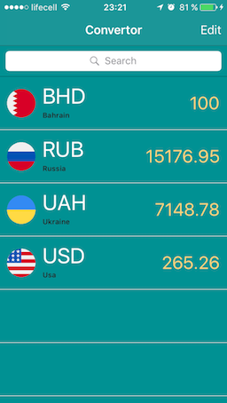
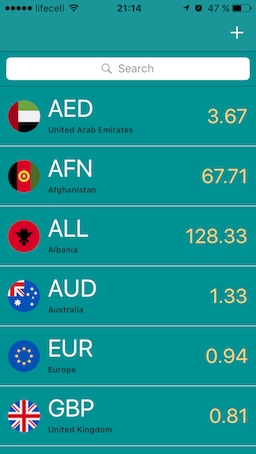
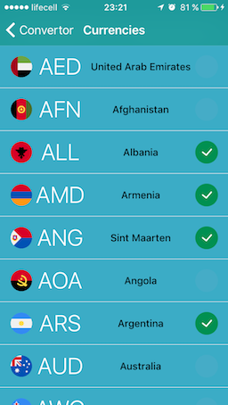
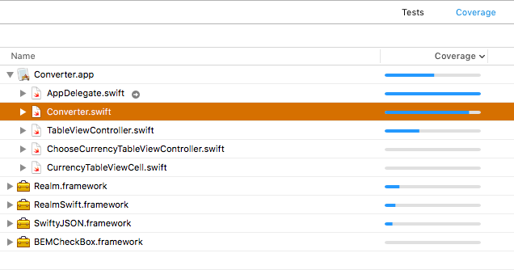

## Converter App for iOS

### About

iOS application written in Swift as school project.

### Shots

### Code Coverage

### UML (Unified Modeling Language)
[Here](https://github.com/ashanaakh/converter/tree/master/UML) you can find a peace of UML diagrams.
